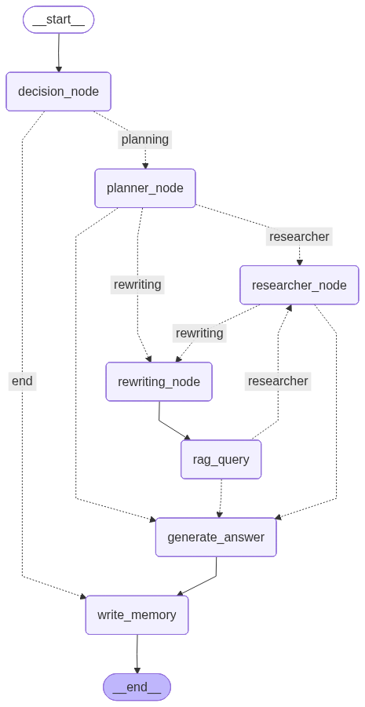

# 🤖 Agent with RAG and Long-Term Memory

This project implements a sophisticated, stateful AI agent that combines a multimodal Retrieval-Augmented Generation (RAG) system with long-term memory. The agent can handle complex queries by planning and dispatching tasks to specialized sub-agents (like a RAG query agent and a web researcher), remember past interactions, and process both text and images.

## ✨ Features

- **Stateful Agentic Workflow**: Uses `LangGraph` to create a dynamic, state-driven graph that determines the best course of action for a given query.
- **🧠 Long-Term Memory**: Connects to a `MongoDB` database to store and retrieve user-specific information, allowing for personalized conversations over time.
- **🖼️ Multimodal RAG System**: Can answer questions about fashion products using both textual descriptions and images. It retrieves information from a `FAISS` vector store.
- **➕ Dynamic Data Integration**: The agent can add new data to the RAG system on the fly, expanding its knowledge base.
- **🤔 Intelligent Task Planning**: An initial "planner" agent decides whether a query requires web research, a RAG database query, or can be answered directly.
- **✍️ Advanced Query Rewriting**: Implements techniques like HyDE (Hypothetical Document Embeddings) to rewrite user queries for more effective retrieval from the vector store.
- **🌐 Web Research Capability**: Integrates `DuckDuckGo` search to answer general knowledge questions that are outside the scope of the fashion dataset.

## 🛠️ Tech Stack

- **Orchestration**: LangChain & LangGraph
- **LLM**: Google Gemini 2.0 Flash (`gemini-2.0-flash`)
- **Database (Long-Term Memory)**: MongoDB
- **Vector Store**: FAISS (Facebook AI Similarity Search)
- **Embedding Model**: `google/embeddinggemma-300m`
- **Multimodal Models**:
  - **Image Captioning**: `Salesforce/blip-image-captioning-base` for generating text descriptions from images.
- **Core Libraries**: PyTorch, Transformers, Pandas, Pydantic

## 🧠 Long-Term Memory Details

The agent is equipped with a long-term memory system that allows it to remember user-specific information across multiple conversations. This is achieved by storing key details about the user in a dedicated **MongoDB** database, which functions as a form of **semantic memory** 🧠. This allows the agent to recall factual information, concepts, and meanings about the user, rather than just isolated, temporal conversational fragments.

### How It Works

1.  **Memory Retrieval**: At the beginning of each interaction, the agent retrieves the user's existing memory from the MongoDB collection based on their unique `user_id`. This memory is then used to personalize the conversation.
2.  **Memory Update**: At the end of each conversation, the `write_memory` node is triggered. This node uses the entire chat history to identify and extract new, relevant information about the user (e.g., preferences, personal details).
3.  **Storage**: The extracted information is then merged with the existing memory and stored back in the MongoDB database, ensuring that the agent's knowledge about the user is always up-to-date.

This mechanism allows the agent to build a continuous, evolving understanding of the user, leading to more natural and personalized interactions over time.

## 🔍 RAG System Details

The core of this agent is its powerful RAG system, designed to provide information about fashion products.

- **Dataset**: The system is built upon the [Fashion Product Images Dataset](https://www.kaggle.com/datasets/paramaggarwal/fashion-product-images-dataset). For this project, a subset of **500 records** (`df_500.csv`) is used.
- **Functionality**:
  1.  **Indexing**: Textual data from the CSV and image descriptions (generated by the BLIP model) are combined and embedded using `embeddinggemma-300m`.
  2.  **Storage**: These embeddings are stored in a FAISS vector index for efficient similarity search.
  3.  **Retrieval**: When a user asks a question (with or without an image), the system generates a combined text-image embedding and searches the FAISS index to find the most relevant products.

## 📂 Project Structure

```
Agent-with-RAG-and-Long-Term-Memory/
│
├── agent/                          # Core package
│   ├── configuration.py            # Configuration dataclass (user_id, etc.)
│   ├── state.py                    # AgentState TypedDict shared across all nodes
│   ├── llm.py                      # Shared LLM singleton (Gemini 2.0 Flash)
│   ├── memory_store.py             # MongoDB + MemorySaver setup & helpers
│   │
│   ├── utils/
│   │   └── image.py                # load_image helper (URL / path / PIL)
│   │
│   ├── rag/
│   │   ├── __init__.py             # Instantiates the shared RagSystem singleton
│   │   └── system.py               # RagSystem class — FAISS + BLIP pipeline
│   │
│   └── nodes/                      # One module per graph node
│       ├── decision.py             # decision_node · decision_router
│       ├── planner.py              # planner_node
│       ├── rewriting.py            # rewriting_node (HyDE query rewriting)
│       ├── rag_query.py            # rag_query node
│       ├── researcher.py           # researcher_node (DuckDuckGo)
│       ├── answer.py               # generate_answer node
│       ├── memory.py               # write_memory node
│       └── router.py               # Shared routing function
│
├── graph.py                        # Thin entrypoint — assembles & compiles the graph
├── configuration.py                # Backward-compat shim → agent.configuration
├── rag_system.py                   # Backward-compat shim → agent.rag.system
│
├── langchain_faiss_index/          # Persisted FAISS vector index
├── langgraph.json                  # LangGraph server config
├── .env.example                    # Environment variable template
└── requirements.txt                # Python dependencies
```

## 🌊 Workflow



## 📦 AgentState

The `AgentState` class is a `TypedDict` that defines the state of the agent at any given time. It is used to pass information between the different nodes in the graph.

- **messages**: Append-only sequence of `BaseMessage` objects representing the conversation history.
- **requires_agent**: `True` if the query needs the agent pipeline; `False` for direct answers.
- **requires_add_data**: `True` if the user wants to add new data to the RAG system.
- **input_img**: Accepts a URL or local file path on entry; converted to a `PIL.Image` by `decision_node` for downstream use.
- **output_img**: URL or path of the product image returned by the RAG system (if applicable).
- **requires_output_img**: `True` if the user explicitly requested a visual output.
- **rag_context**: Text context retrieved from the FAISS vector store.
- **research_answer**: Answer produced by the `researcher_node` via web search.
- **final_answer**: The final response delivered to the user.
- **planned**: Queue of sub-agent names still to be executed (e.g. `["Researcher Agent", "RAG Query Agent"]`).
- **query**: The rewritten / HyDE-expanded query sent to the RAG vector store.

## 🚀 How to Run

1.  **Create and Activate a Virtual Environment**:
    It's recommended to run this project in a dedicated virtual environment.

    ```bash
    # Create the virtual environment
    python -m venv .venv

    # Activate the environment
    # On Windows:
    .venv\Scripts\activate
    # On macOS/Linux:
    source .venv/bin/activate
    ```

2.  **Install Dependencies**:
    ```bash
    pip install -r requirements.txt
    ```

3.  **Set Up Environment**:
    Create a `.env` file in the root directory and add your credentials:
    ```env
    GOOGLE_API_KEY="YOUR_GOOGLE_API_KEY"
    LANGSMITH_API_KEY="YOUR_LANGSMITH_API_KEY"
    LANGCHAIN_TRACING_V2=true
    MONGO_USERNAME="YOUR_MONGO_USERNAME"
    MONGO_PASSWORD="YOUR_MONGO_PASSWORD"
    ```

4.  **Run the Development Server**:
    This project is configured with `langgraph.json`, allowing you to use the LangGraph development server to test and interact with the agent.
    ```bash
    langgraph dev
    ```
    This will start a local server where you can access a web UI to send messages to the agent and visualize the graph's execution flow. Open your browser and navigate to the URL provided in the terminal.
